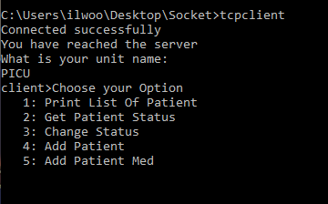

# Introduction
The goal of this project was to create an interface using C++ for users to create, access, and modify data representing patients' medication status at a hospital setting. By utilizing the Socket library, a server-client connection was implemented to retrieve and modify a vector of *Units* representing hospital units. Each *Units* contains a vector of *Patients*, which is composed of a vector of *Meds* containing their delivery status. 

# Background
While working as a Pharmacy Intern over the summer of 2019, I noticed a large amount of missing patient-medications requests due to the lack of communication between the in-patient pharmacy and nurses. Too often, the nurses would call the central pharmacy about questions regarding their patients' medications. A common scenario was pharmacy technicians telling nurses that the medications have been delivered to their floors, but the nurses not being able to find them. In hopes of decreasing such complications in the healthcare setting, I decided create a program that would allow nurses to access and modify the status of their patients' medications from a server rather than calling the pharmacy every so often.

# How it works

This program can be compiled by typing the *make* command then running the server executable first and then the client executable. Upon a successful server-client connection, the server prompts the client for its *Units* name. When an existing *Units* name is entered, the client is prompted to enter a number ranging from 1 to 5, each corresponding to a different task. Each command will prompt the client to enter the desired data. In addition, the nurses could also put in a request for new patient medications by choosing the *"Add Patient Med"* command. To exit, simply type *"quit"* into the client.

This program also stores data externally into a textfile. Every time a server-client connection is made, the server reads in data from the textfile, properly creates classes from the said data, and proceeds to interact with the client. When the server-client connection is broken using the *"quit"* command, the said data of the Units are written back into the textfile.

*For design purposes, the vector of *Units* is stored within the server code itself, as there is a fixed number of Units at a hospital. 

# Possible Improvements
In the future, this project could become more user-friendly by creating a colorful UI-interface. This project could also encript the data textfile and be available only to people with specific logins, as the project does handle patient data. Furthermore, I could utilize an online database such as SQL to store data on the web.  

# Questions and Comments?
Feel free to reach out to me for any reasons via LinkedIn!
https://www.linkedin.com/in/ilwoo12/
